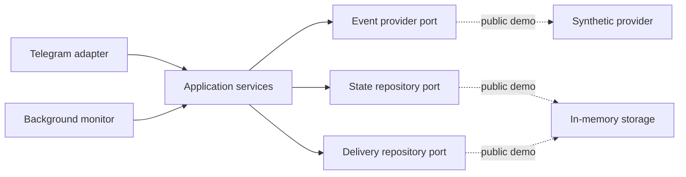

<div align="center">

# STALEM Bot — public showcase

**Архитектурная витрина действующего Telegram-бота для мониторинга игровых событий**

[English version](README_EN.md) · [Кейс](docs/CASE_STUDY.md) · [Архитектура](docs/ARCHITECTURE.md) · [Граница безопасности](docs/SECURITY_BOUNDARY.md)

</div>

> [!IMPORTANT]
> Это не исходный код production-бота. Репозиторий собран отдельно для
> портфолио и демонстрирует инженерные решения без закрытого API, алгоритмов
> прогнозирования, пользовательских данных и инфраструктуры.

## О проекте

STALEM — Telegram-сервис, который отслеживает игровые события на региональных
серверах, показывает текущее состояние и отправляет персональные уведомления.
Production-версией пользуются **более 200 игроков**.

Рабочий проект включает многорегиональный мониторинг, персональные настройки и
часовые пояса, историю событий, общую и личную статистику, fallback при
недоступности API, защиту от повторных уведомлений и административные фоновые
операции.

В production-версии также реализованы:

- отметка готовности к конкретному событию с защитой от повторного нажатия;
- личные серии и процент готовности;
- публикация прогнозов и уже начавшихся событий через inline-режим Telegram;
- персональные ссылки и учёт новых пользователей по приглашениям;
- аналитика активности аудитории за разные периоды;
- безопасные миграции SQLite и автоматические проверки перед слиянием изменений.

- Telegram: [@stalembot](https://t.me/stalembot)
- Разработчик: [@exzoe](https://github.com/exzoe)

## Что показано в репозитории

- асинхронный сервисный слой;
- `Protocol`-интерфейсы и разделение domain / ports / infrastructure;
- параллельный опрос регионов через `asyncio.gather`;
- изоляция ошибок одного региона от остальных;
- fallback на последнее корректное состояние;
- идемпотентная отправка уведомлений;
- synthetic provider вместо реального API;
- unit-тесты и GitHub Actions;
- локальная проверка на случайно добавленные секреты.

## Архитектура



Реальные HTTP-, SQLite- и Telegram-адаптеры остаются в закрытом репозитории.
Подробнее: [docs/ARCHITECTURE.md](docs/ARCHITECTURE.md).

## Структура

```text
stalem-bot-showcase/
├── src/stalem_showcase/
│   ├── domain.py
│   ├── ports.py
│   ├── infrastructure/
│   └── services/
├── examples/
│   └── aiogram_status_handler.py
├── tests/
├── docs/
├── scripts/
├── .github/workflows/tests.yml
└── pyproject.toml
```

## Локальный запуск

Создать и активировать окружение:

```powershell
py -m venv .venv
.\.venv\Scripts\Activate.ps1
```

Установить пакет:

```powershell
python -m pip install -e .
```

Запустить synthetic demo:

```powershell
stalem-showcase
```

Ожидаемый вывод:

```text
RU: active; source=demo-provider; fallback=False
EU: idle; source=demo-provider; fallback=False
NA: idle; source=demo-provider; fallback=False
SEA: idle; source=demo-provider; fallback=False
```

Запустить все проверки:

```powershell
python scripts/check.py
```

## Что намеренно скрыто

Репозиторий не содержит:

- endpoint и контракт официального API;
- рабочие ключи и токены;
- формулы и интервалы прогноза;
- правила определения периодов игровых ресурсов;
- production-схему базы данных и персональную аналитику;
- реализацию inline-публикаций и приглашений;
- админ-панель и массовые рассылки;
- данные пользователей, логи и конфигурацию VPS.

Доступ к production-коду может быть предоставлен работодателю точечно для
технического ознакомления без права копирования и распространения.

## Основной стек production-версии

`Python` · `aiogram 3` · `asyncio` · `aiohttp` · `SQLite/WAL` · `pytest` · `GitHub Actions` · `systemd`

## Статус проекта

STALEM является неофициальным сторонним сервисом и не связан с разработчиками
игры. Названия и товарные знаки принадлежат их правообладателям.
