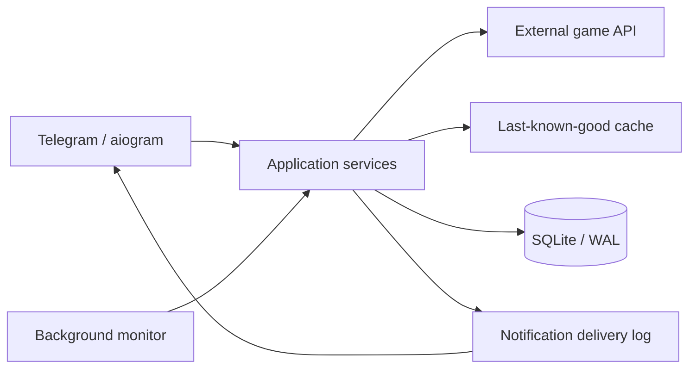

# Архитектура

## Production-концепция

## Границы компонентов

### Domain

Нормализованные модели региона, состояния события и типа уведомления. Domain не
знает о Telegram, HTTP и SQLite.

### Ports

`Protocol`-интерфейсы описывают поставщика состояния, хранилище снимков,
журнал доставок и канал отправки сообщений.

### Services

- `StatusService` получает live-состояние и использует fallback;
- `RegionMonitor` параллельно обрабатывает несколько регионов;
- `NotificationService` гарантирует идемпотентность доставки.

### Infrastructure

В открытой версии используются только synthetic provider и in-memory
репозитории. Production-адаптеры удалены.

## Почему фоновые процессы разделены

Мониторинг внешнего состояния, Telegram polling и массовые операции имеют
разные профили нагрузки и отказов. Изоляция означает, что ошибка одного региона
или одной доставки не останавливает остальные функции сервиса.
